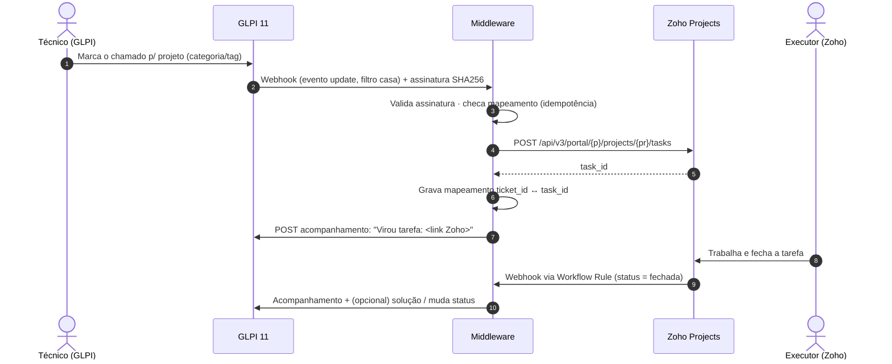

# GLPI → Zoho Projects: chamado vira tarefa de projeto — Estudo e Fluxo

> **Versão**: 1.0.0 | **Última atualização**: 2026-09-30 | **Categoria**: Patterns
> Estudo de integração: um **chamado do GLPI** que é, na verdade, trabalho de projeto vira uma
> **tarefa no Zoho Projects**, mantendo o vínculo e o status dos dois lados. Não existe conector
> nativo entre os dois, então este documento desenha o fluxo sobre as APIs e webhooks documentados nas
> KBs [glpi-api](../platforms/glpi-api.md) e [zoho-projects-api](../platforms/zoho-projects-api.md).
> Nada foi executado: é **estudo de desenho**, não integração em produção.

---

## 📋 Metadata

| Campo | Valor |
|-------|-------|
| **Versão** | 1.0.0 |
| **Data de Criação** | 2026-09-30 |
| **Categoria** | patterns (integração entre plataformas) |
| **Status** | Estudo, não validado contra instâncias reais |
| **KBs-base** | [glpi-api](../platforms/glpi-api.md) · [zoho-projects-api](../platforms/zoho-projects-api.md) |
| **Fontes Principais** | [1] <https://help.glpi-project.org/documentation/modules/configuration/webhook.md> · [2] <https://help.glpi-project.org/documentation/modules/configuration/general/api/restful-api-v2> · [3] <https://projects.zoho.com/api-docs> · [4] <https://www.zoho.com/projects/taskautomation.html> · [5] <https://www.zoho.com/projects/zoho-flow-integrations.html> · [6] <https://github.com/ericferon/glpi-webhook> · [7] <https://forum.glpi-project.org/viewtopic.php?id=294543> · [8] <https://github.com/glpi-project/glpi/issues/20762> |

---

## 📋 Visão Geral

### O problema

O service desk (GLPI) recebe pedidos que **não se resolvem como chamado**: implantar um sistema,
montar a infraestrutura de uma filial, desenvolver um relatório. Esse trabalho precisa de
cronograma, dono e esforço, e isso vive no Zoho Projects. Sem integração, o técnico recria a tarefa
à mão, o solicitante perde a visibilidade e os dois registros divergem.

### A solução, em uma frase

**Um webhook do GLPI dispara um middleware, que cria a tarefa no Zoho e devolve o link ao chamado
como acompanhamento. Quando a tarefa fecha no Zoho, uma regra de workflow notifica o middleware, que
atualiza o chamado.**

### Divisão de responsabilidades

| Sistema | É dono de | Não é dono de |
|---|---|---|
| **GLPI** | Relação com o solicitante, SLA do atendimento, histórico do chamado | Cronograma, esforço, dependências |
| **Zoho Projects** | Execução: responsável, datas, horas, dependências | Comunicação com o solicitante |
| **Middleware** | Mapeamento de ids, tradução de campos, idempotência, retry | Regra de negócio de quando escalar (fica no GLPI) |

---

## 🎯 Casos de Uso

| Use quando | Não use quando |
|---|---|
| O chamado vira **projeto ou entrega com cronograma** (dias/semanas, várias pessoas) | O chamado se resolve em horas por um técnico: fica no GLPI |
| O time de execução **já trabalha no Zoho** | O time executor usa só o GLPI: use **Projetos nativos do GLPI** (o GLPI tem módulo de projetos e tarefas) `[INFERÊNCIA]` |
| É preciso **rastrear de volta**: o solicitante quer saber o andamento pelo chamado | O volume é baixo (poucos por mês): um procedimento manual com link cruzado custa menos `[INFERÊNCIA]` |

---

## 🧭 O Fluxo



### Passo 1 — Gatilho no GLPI: quando um chamado "vira projeto"

**Webhook nativo** (GLPI 11): **Administração → Configuração → Webhooks** [1].

| Campo | Valor recomendado |
|---|---|
| Itemtype / Evento | `Ticket` · **atualização** (e/ou criação) [1] |
| Filtro | Via motor de busca do GLPI: ex. **categoria ITIL = "Projeto / Demanda"** ou uma etiqueta `projeto` [1] |
| URL / Método | `https://middleware/.../glpi/ticket` · `POST` [1] |
| Segurança | **Secret key** (assinatura SHA256) + **expiration delay** contra replay [1] |
| Payload | JSON customizado com `{{item.*}}`: id, título, descrição, entidade, solicitante [1] |
| Retries | Número de tentativas no próprio webhook, via fila `glpi_queuedwebhooks` [1] |

**Qual gatilho escolher** `[INFERÊNCIA]`:

| Opção | Como | Prós | Contras |
|---|---|---|---|
| **A. Decisão humana** (recomendada) | Técnico muda a categoria para "Projeto" | Controle explícito; nada vira tarefa por engano | Depende de disciplina do técnico |
| B. Regra automática | Regra de negócio do GLPI atribui a categoria por critério | Sem clique | Falso positivo cria tarefa indevida |
| C. Polling | Middleware busca chamados a cada N min | Funciona no GLPI 10 sem plugin | Latência + consumo de API |

> **GLPI 10** não tem webhook nativo: use o plugin comunitário `glpi-webhook` [6] ou a opção C.

### Passo 2 — Middleware: validar, deduplicar, traduzir

1. **Validar a assinatura** SHA256 com o secret compartilhado. Rejeite se expirada [1].
2. **Idempotência**: se `glpi_ticket_id` já tem `zoho_task_id` no mapeamento, **não crie outra
   tarefa**. O evento "atualização" dispara de novo a cada edição do chamado `[INFERÊNCIA]`.
3. **Traduzir** os campos (tabela abaixo) e **sanitizar**: remova dados pessoais sensíveis antes de
   sair do GLPI (ver [LGPD](#-segurança-e-lgpd)).

### Passo 3 — Criar a tarefa no Zoho

```http
POST /api/v3/portal/{portal_id}/projects/{project_id}/tasks
Authorization: Bearer <zoho_access_token>        # escopo ZohoProjects.tasks.CREATE
Content-Type: application/json

{
  "name": "[GLPI #4521] Instalar o coletor no centro de distribuição",
  "description": "Origem: chamado GLPI #4521 — https://glpi.exemplo/front/ticket.form.php?id=4521\n\n<descrição sanitizada>",
  "tasklist": { "id": "<tasklist 'Entrada via GLPI'>" },
  "priority": "high",
  "end_date": "2026-10-15T18:00:00Z",
  "owners_and_work": { "owners": [ { "email": "responsavel@exemplo" } ] }
}
```

Campos e limites conforme a doc V3 [3]: `name` é obrigatório; `priority` aceita `none|low|medium|high`;
datas em ISO-8601; sem `tasklist`, a tarefa cai na lista geral.

### Passo 4 — Devolver o vínculo ao GLPI

Acompanhamento (followup) no chamado com o link da tarefa:

| API GLPI | Endpoint |
|---|---|
| V2 (GLPI 11) | Timeline do chamado: `/api.php/v2/Assistance/Ticket/{id}/Timeline/...` [2][8]. Confira o sub-recurso de *Followup* no Swagger `/api.php/doc` da instância |
| V1 (legada) | `POST /apirest.php/ITILFollowup/` com `{"input":{"itemtype":"Ticket","items_id":4521,"content":"..."}}` `[INFERÊNCIA — padrão V1 dos fóruns]` |

Opcional: mudar o chamado para **"Pendente"**, para o SLA do service desk não correr enquanto o
projeto executa `[INFERÊNCIA — política a decidir]`.

### Passo 5 — Volta: Zoho fecha → GLPI atualiza

No Zoho: **Webhook + Workflow Rule** (condição: status da tarefa = fechada) [4]. O webhook chama
`https://middleware/.../zoho/task`. O middleware procura o `ticket_id` pelo `task_id` e:

- posta um acompanhamento ("Tarefa concluída no Zoho por X em Y");
- **opcional**: registra solução / muda o status. A política recomendada é **não fechar
  automaticamente**: o técnico confirma com o solicitante `[INFERÊNCIA]`.

Também dá para espelhar **comentários** do Zoho (`POST .../tasks/{task_id}/comments` [3]) como
acompanhamentos, mas isso dobra o ruído. Comece sem espelhar.

---

## 🗺️ Mapeamento de Campos `[INFERÊNCIA — ajustar ao uso real]`

| GLPI (Ticket) | Zoho (Task) | Regra |
|---|---|---|
| `id` | `name` prefixado `[GLPI #id]` + custom field `cf_glpi_ticket_id` | Chave de rastreio visível e consultável |
| `name` (título) | `name` | Truncar se preciso (limite de 10000 [3]) |
| `content` | `description` | Sanitizada + link para o chamado |
| Entidade / categoria ITIL | Projeto + tasklist | Tabela de roteamento no middleware |
| `urgency`/`priority` 1–5 | `priority` none/low/medium/high | 1–2 → low · 3 → medium · 4–6 → high |
| Técnico atribuído | Não mapeia | O dono da tarefa é definido pelo projeto |
| `time_to_resolve` (SLA) | `end_date` | Só se o SLA representar prazo real do projeto |

### Estados

| Evento Zoho | Efeito no GLPI |
|---|---|
| Tarefa criada | Acompanhamento com link · chamado → Pendente (opcional) |
| Tarefa fechada | Acompanhamento "concluída" · técnico decide a solução |
| Tarefa excluída | Acompanhamento de alerta + chamado volta a "Em atendimento" |

### Tabela de mapeamento (estado do middleware)

`glpi_ticket_id (PK) · zoho_portal_id · zoho_project_id · zoho_task_id · created_at · last_sync_at · last_status`

---

## 🏗️ Onde roda o middleware — opções

| Opção | Quando | Atenção |
|---|---|---|
| **Zoho Flow** | Stack já é Zoho; baixo código [5] | O lado GLPI é HTTP cru (OAuth2 V2 com usuário real) `[INFERÊNCIA]` |
| **n8n** (self-hosted) | Quer visual + controle + rodar na própria infra `[INFERÊNCIA]` | Guardar o refresh token do Zoho com cuidado |
| **Serviço próprio** (script/função) | Precisa de idempotência forte, testes, versionamento | Mais código, mas cabe num repo adotado com o gate |
| Make / Zapier | Protótipo rápido | Dado do chamado passa por terceiro: avaliar LGPD |

---

## 🔒 Segurança e LGPD

- **Minimização**: envie ao Zoho só o necessário para executar. **Dado pessoal sensível
  não trafega** (a regra de dados sensíveis do seu projeto manda). Filtre identificadores diretos,
  nomes de pessoas e anexos antes do POST.
- **Assinatura dos dois lados**: o GLPI assina com SHA256 [1]. Para o webhook do Zoho, use um segredo
  próprio no header ou na URL e valide no middleware `[INFERÊNCIA]`.
- **Credenciais mínimas**: GLPI V2 com usuário técnico de perfil mínimo (client_credentials não vale
  para `api`, ver [glpi-api](../platforms/glpi-api.md)). Zoho com escopos
  `ZohoProjects.tasks.CREATE,ZohoProjects.tasks.UPDATE,ZohoProjects.tasks.READ` (+ `projects.READ`).
- **Segredos** em `.env` / cofre, nunca no payload do webhook nem no repositório.

---

## ⚠️ Limitações e Gotchas

| Gotcha | Detalhe |
|---|---|
| Webhook GLPI depende do cron | A fila é processada pela ação automática `queuedwebhook`. Com o cron parado, nada sai. Há relatos de "webhook não envia" no 11.0.5 [1][7] |
| Evento "update" repete | Toda edição do chamado dispara de novo: idempotência obrigatória no middleware |
| Duplicação no Zoho | Sem mapeamento persistido, um retry cria tarefa duplicada |
| Rate limit / tokens do Zoho | 200 chamadas/2 min por endpoint; renovação de token 10/10 min: cache do token no middleware ([zoho-projects-api](../platforms/zoho-projects-api.md)) |
| Token do GLPI V2 | Exige usuário real (password grant). Senha de usuário técnico passa a ser segredo operacional |
| Timeline V2 | O schema exato de followup na V2 está evoluindo (issue sobre timeline [8]). Valide no Swagger da instância |
| Webhooks do Zoho | Dependem de Workflow Rules; a disponibilidade pode variar por plano `[INFERÊNCIA]` |
| Loop de eventos | Se o middleware atualizar o chamado e isso casar o filtro do webhook, gera loop. O filtro deve olhar só a mudança de categoria, ou o middleware ignora eventos gerados pelo próprio usuário técnico `[INFERÊNCIA]` |

---

## ✅ Checklist de Implantação

1. [ ] Confirmar versões: GLPI **11** (webhook nativo + API V2)? Zoho no DC certo?
2. [ ] Definir o **gatilho** (categoria "Projeto") e a **tabela de roteamento** entidade/categoria → projeto/tasklist
3. [ ] GLPI: usuário técnico + OAuth client (password, escopo `api`, IP restrito)
4. [ ] Zoho: Self Client + refresh token + custom field `cf_glpi_ticket_id`
5. [ ] Middleware com mapeamento persistido, validação de assinatura, retry e log
6. [ ] Webhook GLPI (filtro + secret) e Workflow Rule + Webhook no Zoho
7. [ ] Cron do GLPI ativo (`queuedwebhook`)
8. [ ] Teste dos **modos de falha**: reentrega duplicada, Zoho fora do ar, token expirado, chamado editado 3×, tarefa excluída

---

## 🔗 Integração com o Sistema Onion

- **Onde o estudo vira decisão**: se o projeto adotar o padrão, registrar em `docs/technical-context/` e, sendo
  decisão arquitetural, como ADR (`@c4-documentation-specialist`). A escolha do middleware é a decisão a
  documentar.
- **Onde vira trabalho**: `/product:spec` → `/product:task` (hoje no Linear, provider ativo) para a
  implementação. `/engineer:plan` se o middleware for código próprio.
- **Validação**: o checklist acima segue a doutrina de testar modos de falha, não só o caminho feliz.
- **KBs-base**: [glpi-api](../platforms/glpi-api.md) · [zoho-projects-api](../platforms/zoho-projects-api.md).

---

## 🔗 Referências

1. GLPI Docs, Webhook: <https://help.glpi-project.org/documentation/modules/configuration/webhook.md>
2. GLPI Docs, RESTful API (V2): <https://help.glpi-project.org/documentation/modules/configuration/general/api/restful-api-v2>
3. Zoho Projects V3 API (Create Task, Update Task, Task Comments): <https://projects.zoho.com/api-docs>
4. Zoho Projects, Task Automation (Workflow Rules, Webhooks, Blueprints): <https://www.zoho.com/projects/taskautomation.html>
5. Zoho Projects + Zoho Flow: <https://www.zoho.com/projects/zoho-flow-integrations.html>
6. Plugin comunitário glpi-webhook (GLPI 10): <https://github.com/ericferon/glpi-webhook>
7. Fórum GLPI, "Webhooks not sending from GLPI 11.0.5": <https://forum.glpi-project.org/viewtopic.php?id=294543>
8. GLPI issue #20762, HLAPI timeline users: <https://github.com/glpi-project/glpi/issues/20762>

---

*Estudo gerado em 2026-09-30 via `/meta:create-knowledge-base`. É desenho, não integração testada: valide endpoints no Swagger do GLPI e na doc V3 do Zoho antes de implementar.*
