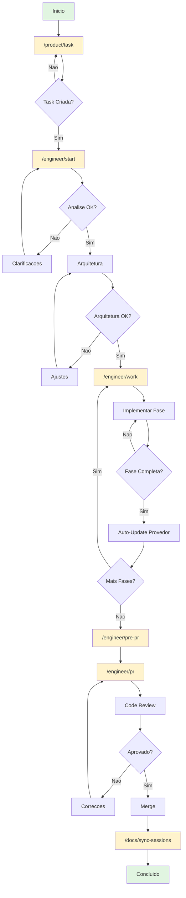
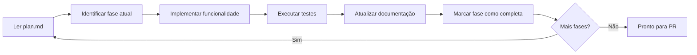
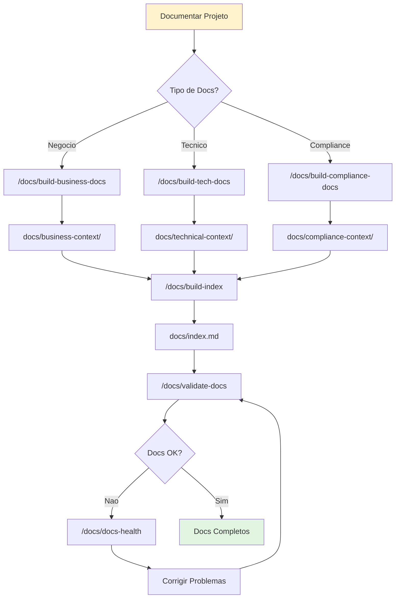
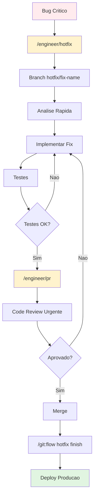
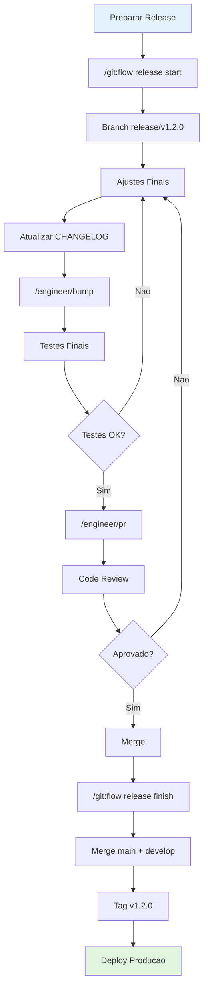
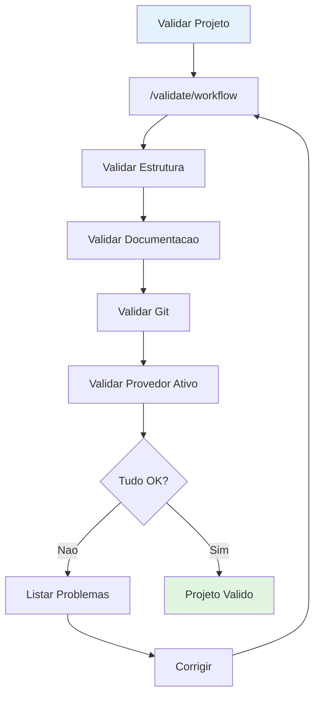
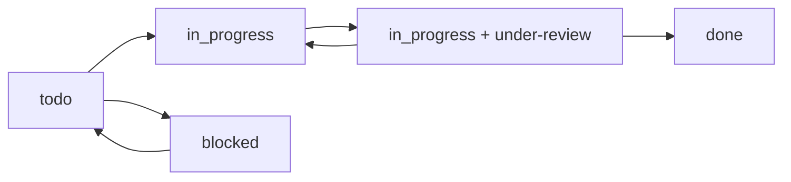
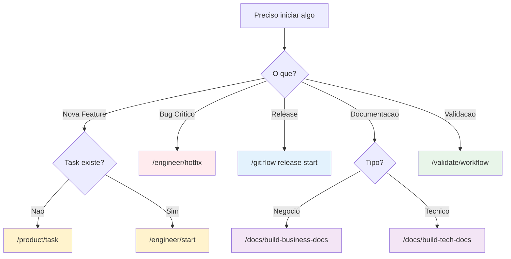
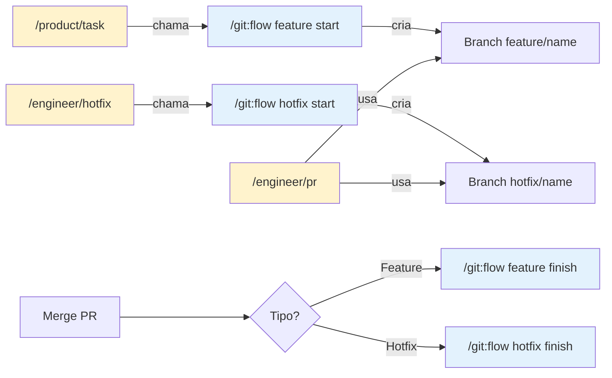

# 🔄 Fluxos de Engenharia Detalhados

> **Versão**: 3.0.0 | **Última atualização**: 2025-11-24

Este guia documenta os workflows completos de desenvolvimento, desde a concepção até a entrega, com integração ao **Task Manager Abstraction**. Todos os fluxos funcionam com qualquer provedor ativo (`TASK_MANAGER_PROVIDER`: `jira` | `clickup` | `asana` | `linear` | `none`); onde um detalhe for específico de um provedor, ele está marcado como tal.

> **Convenção de exemplos:** ao longo do guia usamos um ID genérico de task (`AUTH-123`). No provedor ativo isso corresponde a uma issue do Jira (`AUTH-123`), uma task do ClickUp, uma task do Asana ou uma issue do Linear. O ID exato segue o formato do provedor configurado.

## 🆕 Novidades v3.0

- **Sessions estruturadas** em `.claude/sessions/<feature-slug>/`
- **Comentários de progresso** na task do provedor ativo (detalhado + resumido)
  - _Específico do ClickUp:_ comentários duais usam formatação visual Unicode (ver adapter ClickUp)
  - _Específico do Jira:_ comentários e descrições são renderizados em ADF (Atlassian Document Format)
- **Mapeamento fase→subtask** automático
  - _Específico do ClickUp:_ o mapeamento usa subtasks nativas do ClickUp; em Jira corresponde a sub-tasks/issue links, em Linear a sub-issues, em Asana a subtasks
- **Prompts modulares** em `common/prompts/`

## 📋 Índice de Fluxos

- [🚀 Fluxo Completo: Feature Development](#-fluxo-completo-feature-development)
- [🐛 Fluxo de Correção de Bugs](#-fluxo-de-correção-de-bugs)
- [📚 Fluxo de Documentação](#-fluxo-de-documentação)
- [🔧 Fluxo de Refatoração](#-fluxo-de-refatoração)
- [⚡ Fluxo de Hotfix](#-fluxo-de-hotfix)
- [📦 Fluxo de Release](#-fluxo-de-release)
- [✅ Fluxo de Validação](#-fluxo-de-validação)
- [🎯 Integração com Task Manager por Fluxo](#-integração-com-task-manager-por-fluxo)
- [🤔 Decision Trees](#-decision-trees)
- [🩺 Troubleshooting](#-troubleshooting)
- [🌿 Fluxos Git Avançado](#-fluxos-git-avançado)
- [🤖 Workflows com Agentes Especializados](#-workflows-com-agentes-especializados)

---

## 🚀 Fluxo Completo: Feature Development

### Diagrama do Fluxo



### **Responsabilidades dos Comandos**

| Comando | Responsabilidade | Cria Branch? | Cria Sessão? | Atualiza Provedor? |
|---------|-----------------|--------------|--------------|-------------------|
| `/product/task` | Criar task estruturada | Opcional | Sim | Sim |
| `/engineer/start` | Análise + Arquitetura | Valida/Cria | Valida | Sim |
| `/engineer/work` | Implementação | Não | Não | Sim (por fase) |
| `/engineer/pre-pr` | Validação pré-PR | Não | Não | Não |
| `/engineer/pr` | Pull Request | Se necessário | Não | Sim |
| `/engineer/hotfix` | Correção emergencial | Não | Sim | Sim |

> **Nota sobre Branches:** `/product/task` e `/engineer/start` **gerenciam Git internamente**, chamando `/git/*` automaticamente. O usuário não precisa executar comandos Git manualmente no fluxo normal.

### **Fase 1: Planejamento e Criação da Task**

#### 1.1 Criação da Task
```bash
/product/task "Implementar sistema de autenticação OAuth2 com Google e GitHub"
```

**O que acontece**:
-  Sistema analisa requisitos e contexto do projeto
-  Cria task estruturada no **provedor ativo** com:
  - Título descritivo
  - Descrição detalhada (em ADF no Jira Cloud, Markdown no ClickUp/Linear, notes no Asana)
  - Critérios de aceitação
  - Estimativa inicial
  - Tags/labels relevantes (`feature`, `auth`, `oauth2`)
-  Task fica com status normalizado `to do` no provedor

**Output esperado** (exemplo com provedor ativo):
```
✅ Task criada (provider=jira): AUTH-123
📋 Título: "🔐 Implementar sistema de autenticação OAuth2"
📝 Descrição: Funcionalidade completa de autenticação...
🏷️ Tags/labels: feature, auth, oauth2, high-priority
📊 Estimativa: 8-12 horas
```

#### 1.2 Refinamento (Opcional)
```bash
/product/refine
```

**Usar quando**:
- Requisitos iniciais não estão claros
- Funcionalidade é complexa e precisa de detalhamento
- Stakeholders precisam alinhar expectativas

### **Fase 2: Início do Desenvolvimento**

#### 2.1 Inicialização
```bash
/engineer/start
```

**Input necessário**: ID da task no provedor ativo (`AUTH-123`)

**O que acontece**:
-  Verifica se está em feature branch apropriada
-  Cria pasta `.claude/sessions/auth-oauth2/`
-  Busca detalhes da task no provedor ativo
-  Analisa contexto, objetivos e dependências
-  Identifica arquivos e componentes necessários
-  Cria plan.md inicial

**Estrutura criada** (worklog ACTIVE — definida pela [SSOT do Contrato de Sessão](../knowledge-base/frameworks/gitflow-patterns.md#contrato-de-sessão-de-desenvolvimento)):
```
.claude/sessions/auth-oauth2/
├── STATE.md         # Índice Tier-0 (~1KB): objetivo, map, ponteiro NEXT — ponto de resume
├── context.md       # Metadados + Phase-Subtask Mapping
├── architecture.md  # Decisões arquiteturais (opcional em hotfix)
├── plan.md          # Plano em fases ([DONE]/[ACTIVE]/[TODO])
└── notes.md         # Log append-only
```

#### 2.2 Análise Arquitetural (se necessário)
```bash
/product/light-arch
```

**Usar quando**:
- Funcionalidade impacta arquitetura existente
- Novas integrações são necessárias
- Decisões técnicas precisam ser documentadas

### **Fase 3: Desenvolvimento Iterativo**

#### 3.1 Trabalho na Funcionalidade
```bash
/engineer/work .claude/sessions/auth-oauth2/
```

**O que acontece em cada iteração**:
-  Lê plan.md e identifica fase atual
-  Apresenta próximos passos específicos
-  Delega trabalho para sub-agentes especializados:
  - `nodejs-specialist` para backend
  - `react-developer` para frontend
  - `test-engineer` para testes
-  Atualiza progresso no plan.md
-  Solicita validação antes de próxima fase

**Ciclo típico**:


#### 3.2 Validações Contínuas
Durante o desenvolvimento, o sistema:
- 🔍 Executa testes automaticamente após mudanças
- 📝 Atualiza documentação conforme necessário
- 🔗 Mantém rastreabilidade com a task no provedor ativo
- 📊 Monitora progresso e estima tempo restante

### **Fase 4: Preparação para Review**

#### 4.1 Validações Pré-PR
```bash
/engineer/pre-pr
```

**Verificações realizadas**:
-  Todos os testes passando
-  Cobertura de testes adequada
-  Linting sem erros
-  Documentação atualizada
-  Commits organizados
-  Task sincronizada no provedor ativo

#### 4.2 Criação do Pull Request
```bash
/engineer/pr
```

**O que acontece**:
1. ✅ Execução final de todos os testes
2. ✅ Commit final com mensagem padronizada
3. ✅ **Atualização no provedor ativo**: Task → `in_progress` + tag/label `under-review` (no Jira, via transition — nunca seta `status` direto)
4. ✅ Criação do PR com:
   - Descrição detalhada da implementação
   - Checklist de validações
   - Link para a task no provedor ativo
   - Screenshots/demos se aplicável
5. ✅ Aguarda feedback automatizado (3 min)
6. ✅ Processa comentários e sugere correções

**Template do PR**:
```markdown
## 🔐 Implementar sistema de autenticação OAuth2

### 📋 Resumo
- Implementado OAuth2 com Google e GitHub
- Adicionado middleware de autenticação
- Criados testes unitários e de integração

### 🔗 Relacionado
- Task (provedor ativo): AUTH-123
- Sessão: .claude/sessions/auth-oauth2/

### ✅ Checklist
- [x] Testes passando
- [x] Documentação atualizada
- [x] Linting sem erros
- [x] Task atualizada no provedor ativo
```

### **Fase 5: Review e Finalização**

#### 5.1 Processamento de Feedback
Quando feedback é recebido:
- 🔍 Analisa cada comentário automaticamente
- 💡 Sugere correções específicas
- 🔄 Aplica mudanças aprovadas pelo usuário
-  Marca conversas como resolvidas

#### 5.2 Merge e Finalização
Após aprovação:
- 🔄 Merge do PR
-  **Atualização no provedor ativo**: Task → `done` (no Jira, via transition)
- 📝 Adição de comentário final com resumo
- 🏷️ Adição de tags de conclusão
- 📊 Atualização de métricas de tempo

#### 5.3 Sincronização de Sessão (pós-merge)
```bash
/docs/sync-sessions
```

**O que acontece:**
1. Analisa trabalho realizado na sessão
2. Organiza documentação gerada durante o desenvolvimento
3. Preserva contexto e decisões arquiteturais
4. Gera o **registro ARCHIVED** em `.claude/sessions/archived/YYYY-MM-DD_HHMM_<slug>/` (estrutura na [SSOT](../knowledge-base/frameworks/gitflow-patterns.md#contrato-de-sessão-de-desenvolvimento)):
   - `README.md` (resumo) · `context.md` · `decisions.md` · `changes.md` · `notes.md`
   - `files-changed.txt` · `commands-executed.txt`
5. Atualiza índice de sessões
6. Atualiza provedor ativo para `done`

---

## 🐛 Fluxo de Correção de Bugs

### **Início Rápido para Bugs**
```bash
# Para bugs simples (< 2h)
/product/collect "Bug: Dashboard não carrega dados do usuário após login"
# → Análise rápida e criação de task
/engineer/start
# → Desenvolvimento direto sem sessão complexa
/engineer/work "correção dashboard login"
# → Fix implementado
/engineer/pr
# → PR com correção
```

### **Fluxo Detalhado para Bugs Complexos**

#### 1. Investigação e Documentação
```bash
/product/task "Bug: Dashboard não carrega após login em ambiente de produção"
```

**Informações coletadas**:
- 🔍 Steps to reproduce
- 📊 Dados de erro/logs
- 🎯 Impacto nos usuários
- ⏱️ Urgência da correção

#### 2. Análise Técnica
```bash
/engineer/start  # ID da task de bug
```

**Análise específica para bugs**:
- 🕵️ Root cause analysis
- 📊 Análise de logs e métricas
- 🧪 Testes para reproduzir o problema
- 🔄 Identificação de possíveis regressões

#### 3. Implementação da Correção
```bash
/engineer/work .claude/sessions/bug-dashboard-login/
```

**Foco em**:
- 🎯 Correção mínima necessária
- 🧪 Testes para prevenir regressão
- 📝 Documentação do que causou o bug
- ⚡ Deploy rápido se crítico

#### 4. Validação Extensiva
```bash
/engineer/pre-pr
```

**Validações específicas para bugs**:
-  Bug original corrigido
-  Nenhuma regressão introduzida
-  Testes de edge cases
-  Validação em ambiente similar à produção

---

## 📚 Fluxo de Documentação

### Diagrama do Fluxo



### **Documentação Técnica**
```bash
/docs/build-tech-docs
```

**Produz**:
- 📄 Architecture Decision Records (ADRs)
- 🗺️ Guia de navegação do codebase
- 🤖 Contexto otimizado para IA
- 📋 Guias de desenvolvimento

**Integração com Task Manager**:
-  Cria task de documentação no provedor ativo
- 📊 Organiza por workspace/space/projeto (conforme o provedor)
- 🏷️ Tags/labels por tipo de documentação

### **Documentação de Negócio**
```bash
/docs/build-business-docs
```

**Produz**:
- 👥 Personas e jornadas de usuário
- 📈 Análise competitiva
- 🎯 Estratégia de produto
- 📋 Processos de vendas

---

## 🔧 Fluxo de Refatoração

### **Planejamento de Refatoração**
```bash
/product/task "Refatoração: Migrar sistema de cache para Redis"
/product/light-arch  # Planejar nova arquitetura
```

### **Execução Incremental**
```bash
/engineer/start  # Task de refatoração
/engineer/work   # Implementação por fases
```

**Características especiais**:
- 📊 Métricas de performance antes/depois
- 🧪 Testes de compatibilidade
- 📝 Documentação de migration path
- ⚡ Deploy incremental com feature flags

---

## ⚡ Fluxo de Hotfix

### Diagrama do Fluxo



### **Hotfix Crítico (< 30min)**
```bash
# Criação urgente
/product/collect "CRÍTICO: Sistema de pagamento fora do ar"

# Desenvolvimento express
/engineer/start  # Branch hotfix/payment-fix
/engineer/work "correção sistema pagamento"
/engineer/pr     # PR de emergência

# Provedor ativo: Task marcada como URGENT + notificações
```

**Características do fluxo de hotfix**:
- 🚨 Prioridade máxima no provedor ativo
- ⚡ Branch `hotfix/*` automaticamente a partir de `main`
- 🧪 Testes mínimos mas críticos
- 📢 Notificações para todos stakeholders
- 📊 Deploy direto para produção após approve

### **Passo a Passo**

```bash
# 1. Iniciar hotfix (cria branch + análise rápida)
/engineer/hotfix "fix-payment-timeout"

# 2. Criar PR após implementação
/engineer/pr

# 3. Após merge, finalizar hotfix
/git:flow hotfix finish
```

> `/engineer/hotfix` **cria automaticamente** a branch `hotfix/fix-name` a partir de `main`. Não é necessário executar `/git:flow hotfix start` manualmente.

**O que `/git:flow hotfix finish` faz:**
- Merge emergencial para main/master
- Back-merge automático para develop
- Criação de tag de patch
- Preparação para deploy de produção
- Cleanup de branches
- Atualização do provedor ativo

**Diferenças do Fluxo de Feature:**
- Análise mais rápida (foco no problema, não na arquitetura)
- Menos fases no `plan.md`
- Branch criada a partir de `main` (não `develop`)
- Merge duplo automático (main + develop)
- Deploy imediato após merge

---

## 📦 Fluxo de Release

### Diagrama do Fluxo



### Passo a Passo

```bash
# 1. Criar release branch (suporta semver semântico)
/git:flow release start "v1.2.0"
# ou auto-bump:
/git:flow release start "patch"  # 2.0.1 → 2.0.2
/git:flow release start "minor"  # 2.0.1 → 2.1.0
/git:flow release start "major"  # 2.0.1 → 3.0.0

# 2. Fazer ajustes finais (correções de bugs, atualização de docs)

# 3. Atualizar versão
/engineer/bump minor

# 4. Criar PR
/engineer/pr

# 5. Após merge, finalizar release
/git:flow release finish
```

**O que `/git:flow release finish` faz:**
- Merge para `main`
- Back-merge para `develop`
- Tag anotada com metadata
- Preparação para deploy
- Cleanup de branches
- Atualização do provedor ativo

---

## ✅ Fluxo de Validação

### Diagrama do Fluxo



### Passo a Passo

```bash
# Executar validação completa do projeto
/validate/workflow
```

Usa internamente: estrutura de arquivos, consistência de documentação, estado Git e conectividade com o provedor ativo.

---

## 🎯 Integração com Task Manager por Fluxo

A integração abaixo é descrita em termos de **status normalizados**, que a abstração mapeia para o vocabulário de cada provedor. Itens marcados como _"específico do provedor X"_ não são universais.

### **Estados normalizados da Task (qualquer provedor)**



Status normalizados: `backlog` → `todo` → `in_progress` → `in_review` → `done` (mais `blocked` e `cancelled`). A abstração traduz para os status reais do provedor.

> **Específico do Jira:** mudanças de status nunca são setadas diretamente — são executadas via `POST /issue/{key}/transitions`, respeitando o workflow configurado.

### **Mapeamento de Comandos → Estados (status normalizados)**

| Comando | Estado Inicial | Estado Final | Tags/Labels Adicionadas |
|---------|---------------|-------------|------------------|
| `/product/task` | - | `todo` | Baseado no tipo |
| `/engineer/start` | `todo` | `in_progress` | `development` |
| `/engineer/pr` | `in_progress` | `in_progress` | `under-review` |
| **Após merge** | `in_progress + under-review` | `done` | `completed` |
| **Se bloqueado** | Qualquer | `blocked` | `blocked` + razão |

### **Comentários Automáticos na Task**

O conteúdo dos comentários é o mesmo em qualquer provedor; o **formato de renderização** varia:

| Evento | Comentário Adicionado |
|--------|----------------------|
| Início desenvolvimento | "🚀 Desenvolvimento iniciado na branch: feature/auth-oauth2" |
| Progresso significativo | "📊 Fase X completada: [detalhes da implementação]" |
| PR criado | "🔍 Pull Request criado: [link] - Pronto para review" |
| PR aprovado | "✅ Pull Request aprovado e merged - Funcionalidade entregue" |
| Bug encontrado | "🐛 Bug identificado durante desenvolvimento: [detalhes]" |

**Formatação por provedor:**
- _Específico do ClickUp:_ comentários usam formatação visual Unicode (`━━━`, `∟`, `▶`, `◆`, `✅`) com timestamp + status obrigatórios — ver `.claude/utils/task-manager/adapters/clickup.md`
- _Específico do Jira:_ comentários e descrições são enviados em ADF (JSON estruturado) — ver `adapters/jira.md`
- _Asana:_ notes em HTML (subset) ou plain text — ver `adapters/asana.md`
- _Linear:_ Markdown nativo (suporte rico) — ver `adapters/linear.md`

### **Subtasks por fase (hierarquia)**

O mapeamento fase→subtask existe em todos os provedores, com nomenclatura própria:

| Provedor | Mecanismo |
|----------|-----------|
| **Jira** | Sub-tasks ou issue links |
| **ClickUp** | Subtasks nativas (_específico do ClickUp:_ checklists nativos também são suportados via `/product/checklist-sync`) |
| **Asana** | Subtasks |
| **Linear** | Sub-issues |

### **Campos Customizados Sincronizados**

> **Específico do provedor:** a sincronização granular de campos abaixo está implementada para o **ClickUp** (custom fields). Em Jira, mapeia-se para campos customizados / story points; em Asana, para custom fields do projeto; em Linear, para estimates/labels. Verifique o adapter do provedor para a cobertura exata.

| Campo | Origem | Atualização |
|-------|--------|-------------|
| **Tempo Estimado** | `/product/task` análise | Refinado durante desenvolvimento |
| **Tempo Real** | Timer automático | Durante `/engineer/work` |
| **Branch** | `/engineer/start` | Nome da branch Git |
| **PR Link** | `/engineer/pr` | Link direto do GitHub/GitLab |
| **Arquivos Alterados** | Análise Git | Lista de arquivos modificados |
| **Linhas de Código** | Análise Git | Stats de adição/remoção |

### **Notificações e Webhooks**

**Configurações recomendadas**:
- 📧 **Email**: Mudanças de status críticas
- 💬 **Slack**: Updates de desenvolvimento em canal do projeto  
- 📱 **Mobile**: Apenas para tasks URGENT/HIGH priority
- 🔔 **Desktop**: Pull Requests prontos para review

---

## 🤔 Decision Trees

### Qual comando usar para iniciar?



### Quando usar cada comando?

#### Comandos de Produto

| Cenário | Comando | Razão |
|---------|---------|-------|
| Criar nova feature | `/product/task` | Cria task estruturada no provedor + branch + sessão |
| Refinar requisitos | `/product/refine` | Detalhamento quando requisitos não estão claros |
| Planejar arquitetura | `/product/light-arch` | Mudanças que impactam arquitetura existente |

#### Comandos de Engenharia

| Cenário | Comando | Razão |
|---------|---------|-------|
| Iniciar desenvolvimento | `/engineer/start` | Análise + arquitetura + setup de sessão |
| Implementar fase | `/engineer/work` | Implementa código seguindo `plan.md` |
| Validar antes de PR | `/engineer/pre-pr` | Checklist de qualidade completo |
| Criar Pull Request | `/engineer/pr` | Abre PR e atualiza provedor ativo |
| Atualizar PR | `/engineer/pr-update` | Atualiza PR existente com novas mudanças |
| Bug crítico em produção | `/engineer/hotfix` | Análise rápida + implementação urgente |
| Validar fase | `/engineer/validate-phase-sync` | Valida sincronização fase ↔ subtask |

#### Comandos de Documentação

| Cenário | Comando | Razão |
|---------|---------|-------|
| Após merge concluído | `/docs/sync-sessions` | Arquiva sessão e atualiza provedor ativo |
| Gerar docs de negócio | `/docs/build-business-docs` | Documentação de contexto de negócio |
| Gerar docs técnicos | `/docs/build-tech-docs` | Documentação de arquitetura e stack |
| Criar índice | `/docs/build-index` | Índice navegável de toda documentação |
| Validar documentação | `/docs/validate-docs` | Verifica completude e consistência |
| Verificar saúde | `/docs/docs-health` | Links quebrados, inconsistências |

> **Regra de Ouro:** Use sempre `/product/*` e `/engineer/*` para desenvolvimento. Comandos Git são gerenciados automaticamente pelos fluxos de produto e engenharia.

---

## 📊 Métricas e Relatórios

### **Métricas Coletadas Automaticamente**
- ⏱️ Tempo por fase de desenvolvimento
- 🧪 Cobertura de testes por funcionalidade
- 🔄 Frequência de revisões de código
- 📈 Velocity da equipe (story points/sprint)
- 🐛 Taxa de bugs encontrados pós-deploy

### **Dashboards / Relatórios Sugeridos** (qualquer provedor)
1. **Desenvolvimento Ativo**: Tasks in progress + tempo decorrido
2. **Pipeline de Review**: PRs aguardando review + tempo de espera
3. **Bugs e Hotfixes**: Tasks críticas + tempo de resolução
4. **Documentação**: Status de docs por projeto

---

## 🩺 Troubleshooting

### Problema: Branch já existe

**Sintoma:** Erro ao criar branch com `/git:flow feature start`

**Solução:**
```bash
# Opção 1: Usar branch existente
git checkout feature/nome-existente

# Opção 2: Verificar e recriar
git branch -a
git branch -D feature/nome-existente
git push origin --delete feature/nome-existente
/git:flow feature start "nome-existente"
```

---

### Problema: Sessão não encontrada

**Sintoma:** `/engineer/work` não encontra arquivos da sessão

**Solução:**
```bash
# Verificar se sessão existe
ls .claude/sessions/

# Se não existe, criar com /engineer/start
/engineer/start <feature-slug>
```

---

### Problema: Provedor ativo não atualiza

**Sintoma:** Comandos não atualizam status no provedor configurado

**Diagnóstico:**
1. Verificar se `context.md` tem `task-id` correto
2. Verificar variáveis do provider no `.env` (ver CLAUDE.md — Tabela Provider → Variáveis)
3. Verificar permissões do token de API

```bash
# Verificar task-id no context.md
grep "task" .claude/sessions/<feature-slug>/context.md

# Verificar provider ativo
grep TASK_MANAGER_PROVIDER .env
```

Se variáveis ausentes → use `/meta:setup-integration` para reconfigurar.

---

### Problema: Mapeamento fase→subtask incorreto

**Sintoma:** Subtask errada é atualizada ao completar fase

**Solução:**
```bash
# Validar mapeamento
/engineer/validate-phase-sync

# Corrigir manualmente no context.md se necessário
```

---

### Problema: Sessão não sincroniza após merge

**Sintoma:** `/docs/sync-sessions` não detecta arquivos

**Solução:**
1. Verificar se há arquivos modificados
2. Verificar `.gitignore` para exclusões acidentais

```bash
# Verificar arquivos modificados
git status

# Forçar sincronização
/docs/sync-sessions --force

# Validar estrutura
/docs/sync-sessions --validate-only
```

---

### Problema: Conflitos de merge

**Sintoma:** Merge falha com conflitos

**Solução:**
```bash
# Verificar conflitos
git status

# Resolver manualmente (editar arquivos com conflitos)
# Marcar como resolvido
git add <arquivo-resolvido>
git commit -m "resolve merge conflicts"
```

---

### Problema: Tag já existe (release)

**Sintoma:** Erro ao tentar criar tag durante `/git:flow release finish`

**Solução:**
```bash
# Listar tags existentes
git tag

# Deletar tag local (se incorreta)
git tag -d v1.0.0

# Deletar tag remota
git push origin --delete v1.0.0

# Recriar release
/git:flow release start "v1.0.0"
```

---

## 🌿 Fluxos Git Avançado

> **IMPORTANTE:** Esta seção é para **uso avançado** ou **troubleshooting**. Os comandos Git são **chamados automaticamente** pelos comandos de engenharia e produto. Na maioria dos casos, você **não precisa** executá-los manualmente.

### Quando Usar Comandos Git Diretamente

Use comandos Git **apenas** nestas situações:

1. **Troubleshooting:** Corrigir problemas de branch ou merge
2. **Operações Manuais:** Quando comandos de engenharia não cobrem o caso
3. **Releases:** Gerenciar releases e tags
4. **Hotfix Finalização:** Após merge do PR de hotfix

### Comandos Git Disponíveis

#### Feature Branches

| Comando | Uso | Quando Usar |
|---------|-----|-------------|
| `/git:flow feature start` | Criar feature branch | **Automático** via `/product/task` |
| `/git:flow feature finish` | Finalizar feature | Após merge do PR |

#### Hotfix Branches

| Comando | Uso | Quando Usar |
|---------|-----|-------------|
| `/git:flow hotfix start` | Criar hotfix branch | **Automático** via `/engineer/hotfix` |
| `/git:flow hotfix finish` | Finalizar hotfix | Após merge do PR de hotfix |

#### Release Management

| Comando | Uso | Quando Usar |
|---------|-----|-------------|
| `/git:flow release start` | Criar release | Preparar nova versão |
| `/git:flow release finish` | Finalizar release | Deploy para produção |

#### Operações Gerais

| Comando | Uso | Quando Usar |
|---------|-----|-------------|
| `/git:init` | Inicializar Git | Novo projeto |
| `/git:help` | Ajuda Git | Consultar comandos |
| `/git:sync` | Sincronizar branches | Atualizar com remoto |

### Integração Git ↔ Engenharia



### Checklist de Operações Git Manuais

Antes de usar comandos Git diretamente, verifique:

- [ ] O comando de engenharia equivalente não resolve?
- [ ] É realmente necessário fazer manualmente?
- [ ] Entendo o impacto da operação?
- [ ] Fiz backup/commit das mudanças?
- [ ] Estou na branch correta?

> Na dúvida, use comandos de engenharia. Eles são mais seguros e integrados ao fluxo completo.

---

## 💡 Melhores Práticas

### **Para Desenvolvimento Eficiente**
1. ✅ **Sempre use `/product/task`** antes de começar desenvolvimento
2. ✅ **Execute `/engineer/start`** para setup completo do ambiente
3. ✅ **Trabalhe em sessões focadas** com `/engineer/work`
4. ✅ **Faça commits pequenos e frequentes** durante o desenvolvimento
5. ✅ **Use `/engineer/pre-pr`** antes de submeter para review

### **Para Integração com Task Manager Otimizada** (qualquer provedor)
1. 🏷️ **Use tags/labels consistentes** para facilitar filtros e busca
2. 📝 **Mantenha descrições atualizadas** durante o desenvolvimento
3. 🔗 **Vincule sempre** PRs às tasks correspondentes
4. 📊 **Monitore métricas** para identificar bottlenecks
5. 📢 **Configure notificações** adequadas para sua equipe
6. 🚀 **Bulk-first**: ao operar em lote, prefira endpoints de bulk (ex.: Jira `/issue/bulk`) para evitar N+1 calls

### **Para Qualidade de Código**
1. 🧪 **Testes primeiro** - escreva testes antes da implementação
2. 📝 **Documente decisões** importantes em ADRs
3. 🔍 **Code review obrigatório** - nunca merge sem review
4. 📊 **Monitore cobertura** de testes em cada PR
5. ⚡ **Deploy incremental** para funcionalidades complexas

---

## 🤖 Workflows com Agentes Especializados

### **Fluxo de Desenvolvimento Especializado por Tecnologia**

#### **Node.js/Backend Development**
```bash
# 1. Iniciar com agente especializado
@nodejs-specialist "Implementar API REST com Express e TypeScript"

# 2. Desenvolvimento focado
/engineer/start 
# → O sistema detecta contexto Node.js e sugere nodejs-specialist

# 3. Review especializado
@code-reviewer "Review de código Node.js com foco em performance"
```

**Vantagens**:
- 🎯 **Contexto especializado** em Node.js v22.14.0+
- ⚡ **Performance otimizada** para aplicações backend
- 🔒 **Segurança** com melhores práticas Node.js
- 📊 **Métricas** específicas de APIs e serviços

#### **Frontend/React Development**
```bash
# Desenvolvimento React com agente especializado
@react-developer "Criar componente de dashboard com hooks customizados"

# Seguindo o fluxo padrão mas com contexto React
/engineer/start
/engineer/work
/engineer/pr
```

**Recursos Exclusivos**:
- ⚛️ **React 18+ patterns** (Concurrent Features, Suspense)
- 🎨 **CSS-in-JS** e styling best practices
- 🧪 **Testing Library** e Jest configurações otimizadas
- 📱 **Responsive design** automático

### **Fluxo de Arquitetura e Documentação**

#### **C4 Architecture Modeling**
```bash
# Para mudanças arquiteturais significativas
@c4-architecture-specialist "Modelar arquitetura de microserviços"

# Seguido por documentação especializada
@c4-documentation-specialist "Documentar decisões arquiteturais"
```

**Entregáveis Automáticos**:
- 📐 **Diagramas C4** (Context, Container, Component, Code)
- 📋 **ADRs** (Architecture Decision Records)
- 🗂️ **Documentação técnica** estruturada
- 📊 **Análise de impacto** em sistemas existentes

#### **Mermaid Diagrams Workflow**
```bash
# Para visualizações técnicas
@mermaid-specialist "Criar fluxograma do processo de checkout"

# Integrado ao desenvolvimento
/engineer/work "documentar fluxos com diagramas"
```

### **Fluxo Git Avançado com Specialists**

#### **GitFlow Specialist Workflow**
```bash
# Para repositórios complexos
@gitflow-specialist "Configurar strategy de branching para equipe"

# Comandos especializados
/git:flow release start
/git:flow hotfix start
/git:flow feature finish
```

#### **Task Manager Specialist Integration (específico do provedor ativo)**

O roteamento para o especialista depende de `TASK_MANAGER_PROVIDER`:

```bash
# Jira (provider=jira)
@jira-specialist "Configurar JQL, transitions e bulk operations"

# ClickUp (provider=clickup)
@clickup-specialist "Configurar automações avançadas e custom fields"

# Asana / Linear (provider=asana | linear)
@task-specialist "Decompor e sincronizar tasks no provedor ativo"

# Melhoria técnica genérica (qualquer provedor)
/engineer/work "otimizar sincronização com o Task Manager ativo"
```

> Estratégia/priorização → `@product-agent`; decomposição agnóstica → `@task-specialist`; operação técnica do provedor → especialista do provedor (`@jira-specialist`, `@clickup-specialist`).

### **Coordenação Multi-Agente**

#### **Exemplo: Feature Complexa com Múltiplos Agentes**
```bash
# Sistema ativa automaticamente:
# - @nodejs-specialist: Backend de pagamentos
# - @react-developer: Interface de checkout
# - @test-engineer: Testes de integração
# - @c4-architecture-specialist: Modelagem de segurança
```

**Fluxo Coordenado**:
1. **Fase 1**: Modelagem arquitetural
2. **Fase 2**: Implementação backend
3. **Fase 3**: Desenvolvimento frontend
4. **Fase 4**: Testes de integração
5. **Fase 5**: Deploy coordenado

---

---

## 🔗 Documentos Relacionados

- [Guia de Comandos](./commands-guide.md) — Referência completa de comandos (92 comandos em 10 categorias)
- [Referência de Agentes](./agents-reference.md) — 51 agentes especializados em 9 categorias
- [Task Manager Abstraction](../knowledge-base/concepts/task-manager-abstraction.md) — Abstração provider-agnóstica
- Adapters por provedor: `.claude/utils/task-manager/adapters/` (`jira.md`, `clickup.md`, `asana.md`, `linear.md`)
- Adapter de forge (PR/CI): `.claude/utils/forge/adapters/github.md`
