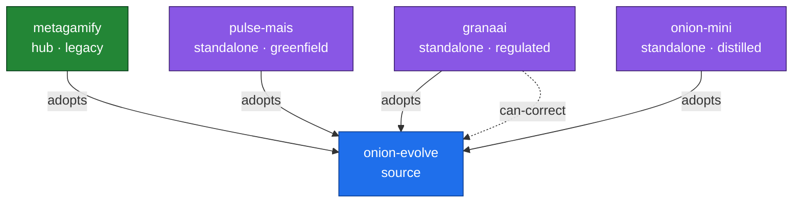

# Mapa de Adoções — Federação Onion (GERADO; não editar à mão)

> Gerado por `.claude/validation/graph.sh --map` de `docs/evolution/federation/members.yaml` (SSOT).
> **Derivado**, não desenhado à mão — muda quando o `members.yaml` muda. Renderiza no GitHub sem build.

## Membros (derivado do SSOT)

| id | tier | mode | specializations | pin |
|----|------|------|-----------------|-----|
| onion-evolve | source |  | framework-template, sdaal, co-evolution, dogfooding, breadcrumbs | `—` |
| metagamify | hub | legacy | gamification, nx-monorepo, asana-integration, metagamification | `8e22352da32f` |
| pulse-mais | standalone | greenfield | education, srl-plea, learning-materials | `c711baa17617` |
| granaai | standalone | regulated | regulated-fintech, canonicalization, ssot-governance | `4332ac8d1884` |
| onion-mini | standalone | distilled | distilled-methodology, entry-level, multi-platform, task-management-lite, plea-cycles | `n/a` |
