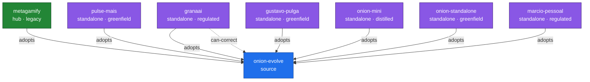

# Mapa de Adoções — Federação Onion (GERADO; não editar à mão)

> Gerado por `.claude/validation/graph.sh --map` de `docs/evolution/federation/members.yaml` (SSOT).
> **Derivado**, não desenhado à mão — muda quando o `members.yaml` muda. Renderiza no GitHub sem build.

## Membros (derivado do SSOT)

| id | tier | mode | specializations | pin |
|----|------|------|-----------------|-----|
| onion-evolve | source |  | framework-template, sdaal, co-evolution, dogfooding, breadcrumbs | `—` |
| metagamify | hub | legacy | gamification, nx-monorepo, asana-integration, metagamification | `9547ca7b3f72` |
| pulse-mais | standalone | greenfield | education, srl-plea, learning-materials | `c711baa17617` |
| granaai | standalone | regulated | regulated-fintech, canonicalization, ssot-governance | `6cc162f32d1c` |
| gustavo-pulga | standalone | greenfield | field-dogfood, greenfield-adoption | `c9eb2c40bc3b` |
| onion-mini | standalone | distilled | distilled-methodology, entry-level, multi-platform, task-management-lite, plea-cycles | `n/a` |
| onion-standalone | standalone | greenfield | framework-door, role-scoped-adopt, public-distribution, claude-code | `514dda85833a` |
| marcio-pessoal | standalone | regulated | life-kg, kg-sdaal-method, research-arm, n1-dogfood | `n/a` |
