# Mapa de Adoções — Federação Onion (GERADO; não editar à mão)

> Gerado por `.claude/validation/graph.sh --map` de `docs/evolution/federation/members.yaml` (SSOT).
> **Derivado**, não desenhado à mão — muda quando o `members.yaml` muda. Renderiza no GitHub sem build.

```mermaid
flowchart TD
  onion_evolve["onion-evolve<br/>source"]:::source
  metagamify["metagamify<br/>hub · legacy"]:::hub
  pulse_mais["pulse-mais<br/>standalone · greenfield"]:::standalone
  granaai["granaai<br/>standalone · regulated"]:::standalone
  gustavo_pulga["gustavo-pulga<br/>standalone · greenfield"]:::standalone
  onion_mini["onion-mini<br/>standalone · distilled"]:::standalone
  onion_standalone["onion-standalone<br/>standalone · greenfield"]:::standalone
  vendas_pdi_enterprise["vendas-pdi-enterprise<br/>standalone · greenfield"]:::standalone
  onion_core["onion-core<br/>standalone · greenfield"]:::standalone
  onion_codex["onion-codex<br/>standalone · distilled"]:::standalone
  marcio_pessoal["marcio-pessoal<br/>standalone · regulated"]:::standalone
  onion_pedro["onion-pedro<br/>standalone · greenfield"]:::standalone
  onion_arthur["onion-arthur<br/>standalone · greenfield"]:::standalone
  poc_venda_direta_pdi["poc-venda-direta-pdi<br/>standalone · greenfield"]:::standalone
  arandek["arandek<br/>standalone · legacy"]:::standalone
  onion_dist["onion-dist<br/>standalone · greenfield"]:::standalone
  sacola_de_ideias["sacola-de-ideias<br/>standalone · greenfield"]:::standalone
  portal_gamificacao["portal-gamificacao<br/>standalone · greenfield"]:::standalone
  jogo_da_vida["jogo-da-vida<br/>standalone · greenfield"]:::standalone
  metagamify -->|adopts| onion_evolve
  pulse_mais -->|adopts| onion_evolve
  granaai -->|adopts| onion_evolve
  granaai -.->|can-correct| onion_evolve
  gustavo_pulga -->|adopts| onion_evolve
  onion_mini -->|adopts| onion_evolve
  onion_standalone -->|adopts| onion_evolve
  vendas_pdi_enterprise -->|adopts| onion_evolve
  onion_core -->|adopts| onion_evolve
  onion_codex -->|adopts| onion_evolve
  marcio_pessoal -->|adopts| onion_evolve
  onion_pedro -->|adopts| onion_evolve
  onion_arthur -->|adopts| onion_evolve
  poc_venda_direta_pdi -->|adopts| onion_evolve
  arandek -->|adopts| onion_evolve
  onion_dist -->|adopts| onion_evolve
  sacola_de_ideias -->|adopts| onion_evolve
  portal_gamificacao -->|adopts| onion_evolve
  jogo_da_vida -->|adopts| onion_evolve
  classDef source fill:#1f6feb,color:#fff,stroke:#0b3d91;
  classDef hub fill:#238636,color:#fff,stroke:#033a16;
  classDef standalone fill:#8957e5,color:#fff,stroke:#3c1e70;
```

## Membros (derivado do SSOT)

| id | tier | mode | specializations | pin |
|----|------|------|-----------------|-----|
| onion-evolve | source |  | framework-template, sdaal, co-evolution, dogfooding, breadcrumbs | `—` |
| metagamify | hub | legacy | gamification, nx-monorepo, asana-integration, metagamification | `21213cc6c3d6` |
| pulse-mais | standalone | greenfield | education, srl-plea, learning-materials | `c711baa17617` |
| granaai | standalone | regulated | regulated-fintech, canonicalization, ssot-governance | `6cc162f32d1c` |
| gustavo-pulga | standalone | greenfield | field-dogfood, greenfield-adoption | `c9eb2c40bc3b` |
| onion-mini | standalone | distilled | distilled-methodology, entry-level, multi-platform, task-management-lite, plea-cycles | `n/a` |
| onion-standalone | standalone | greenfield | framework-door, role-scoped-adopt, public-distribution, claude-code | `514dda85833a` |
| vendas-pdi-enterprise | standalone | greenfield | vendas, spec-as-code, rag-bridge | `24118c5d7a97` |
| onion-core | standalone | greenfield | public-door, full-machinery, hub-role, deterministic-guards | `4299290b73d4` |
| onion-codex | standalone | distilled | substrate-port, openai-codex, portability-proof, deterministic-guards | `n/a` |
| marcio-pessoal | standalone | regulated | life-kg, kg-sdaal-method, research-arm, n1-dogfood | `n/a` |
| onion-pedro | standalone | greenfield | field-dogfood, greenfield-adoption, compliance | `165e1e13b11f` |
| onion-arthur | standalone | greenfield | greenfield-adoption, design, branding, storytelling | `165e1e13b11f` |
| poc-venda-direta-pdi | standalone | greenfield | greenfield-adoption, document-comparison, compliance-nda, public-procurement | `219e9a5f365b` |
| arandek | standalone | legacy | field-dogfood, legacy-adoption, monorepo, upstream-signal | `65d8a7501a03` |
| onion-dist | standalone | greenfield | distribution-algorithms, kg-sdaal-method, research-arm, benchmarking | `e88c1e11e051` |
| sacola-de-ideias | standalone | greenfield | astro-site, institutional, greenfield-dogfood | `8e2517724c0a` |
| portal-gamificacao | standalone | greenfield | gamification, maagica, collaborator-layer, kg-sealing-field-signal, domain-kb-two-layers | `2e3f3a6f88ce` |
| jogo-da-vida | standalone | greenfield | gamification, maagica, expo-universal, turborepo, kg-radar-js-port, pre-adoption-dogfood | `2e3f3a6f88ce` |
