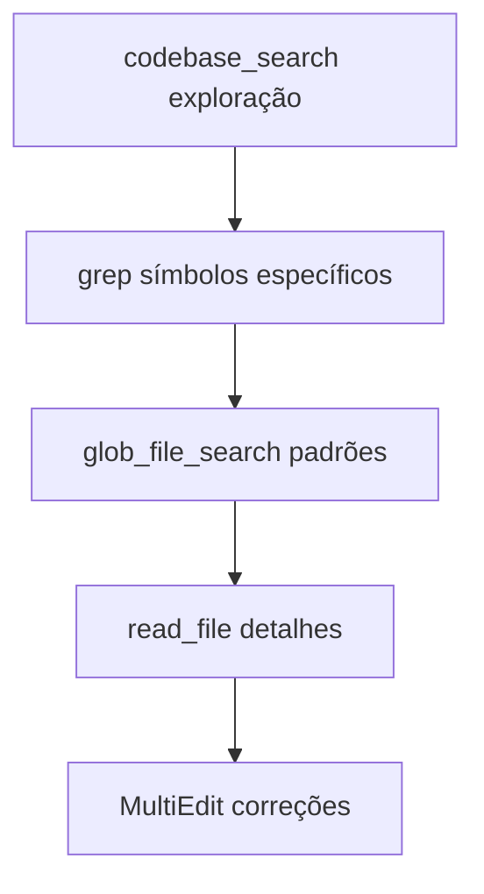
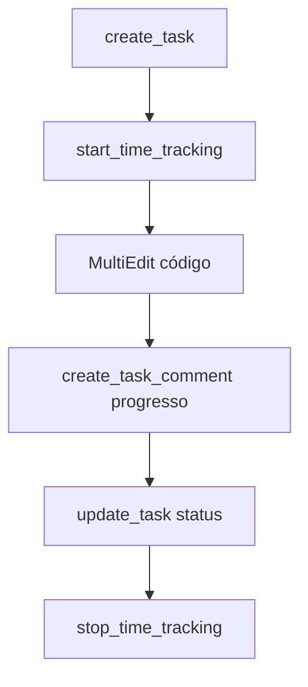
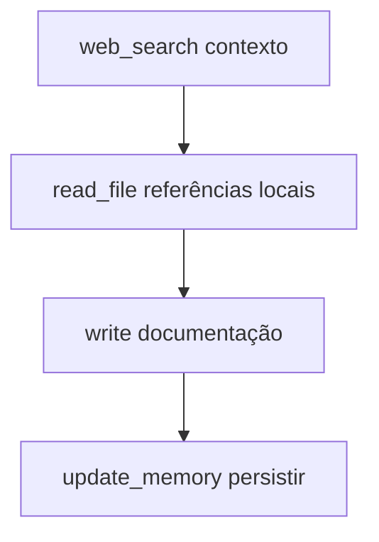

# 🛠️ Referência Completa de Ferramentas

Este documento lista todas as ferramentas disponíveis no sistema Onion em formato TypeScript, organizadas por categoria para facilitar o uso e compreensão.

## 📋 Índice por Categoria

- [📁 Busca e Exploração de Código](#-busca-e-exploração-de-código)
- [📝 Manipulação de Arquivos](#-manipulação-de-arquivos)
- [⚡ Terminal e Execução](#-terminal-e-execução)
- [📓 Jupyter Notebooks](#-jupyter-notebooks)
- [🔍 Linting](#-linting)
- [🌐 Busca na Web](#-busca-na-web)
- [🧠 Memórias](#-memórias)
- [✅ Gestão de Tarefas](#-gestão-de-tarefas)
- [🔌 MCP Resources](#-mcp-resources)
- [📋 ClickUp MCP](#-clickup-mcp-gestão-de-projetos)
- [🌿 Comandos Git Gitflow](#-comandos-git-gitflow)

---

## 📁 Busca e Exploração de Código

### `codebase_search`
```typescript
function codebase_search(
  query: string,
  target_directories: string[],
  explanation: string,
  search_only_prs?: boolean
): Promise<SearchResults>
```
**Propósito**: Busca semântica por significado no código, não por texto exato

**Quando usar**:
-  Explorar codebases desconhecidas
-  Perguntas sobre "como/onde/o que" funciona
-  Encontrar código por significado

**Exemplo**:
```bash
codebase_search("como funciona autenticação de usuários", ["src/auth"], "Encontrar fluxo de auth")
```

### `grep`
```typescript
function grep(
  pattern: string,
  path?: string,
  output_mode?: "content" | "files_with_matches" | "count",
  type?: string,
  glob?: string,
  multiline?: boolean,
  head_limit?: number,
  A?: number, // context after
  B?: number, // context before  
  C?: number, // context both
  i?: boolean // case insensitive
): Promise<GrepResults>
```
**Propósito**: Busca poderosa baseada em ripgrep com regex completo

**Quando usar**:
-  Busca exata de símbolos/strings
-  Padrões regex complexos
-  Múltiplos arquivos rapidamente

### `glob_file_search`
```typescript
function glob_file_search(
  glob_pattern: string,
  target_directory?: string
): Promise<FileList>
```
**Propósito**: Busca arquivos por padrões glob

**Exemplo**:
```bash
glob_file_search("**/*.test.ts") // Todos arquivos de teste TypeScript
```

---

## 📝 Manipulação de Arquivos

### `read_file`
```typescript
function read_file(
  target_file: string,
  offset?: number,
  limit?: number
): Promise<FileContent>
```
**Propósito**: Leitura de arquivos do sistema local com numeração de linha

### `write`
```typescript
function write(
  file_path: string,
  contents: string
): Promise<WriteResult>
```
**Propósito**: Escrita/sobrescrever arquivos no sistema local

### `search_replace`
```typescript
function search_replace(
  file_path: string,
  old_string: string,
  new_string: string,
  replace_all?: boolean
): Promise<ReplaceResult>
```
**Propósito**: Substituição exata de strings em arquivos

### `MultiEdit`
```typescript
interface EditOperation {
  old_string: string;
  new_string: string;
  replace_all?: boolean;
}

function MultiEdit(
  file_path: string,
  edits: EditOperation[]
): Promise<MultiEditResult>
```
**Propósito**: Múltiplas edições em um único arquivo de forma atômica

### `delete_file`
```typescript
function delete_file(
  target_file: string,
  explanation: string
): Promise<DeleteResult>
```
**Propósito**: Exclusão de arquivos

### `list_dir`
```typescript
function list_dir(
  target_directory: string,
  ignore_globs?: string[]
): Promise<DirectoryListing>
```
**Propósito**: Listagem de diretórios com filtros opcionais

---

## ⚡ Terminal e Execução

### `run_terminal_cmd`
```typescript
function run_terminal_cmd(
  command: string,
  is_background: boolean,
  explanation?: string
): Promise<CommandResult>
```
**Propósito**: Execução de comandos no terminal com controle de background

**Características**:
- Suporte a comandos background (`is_background: true`)
- Flags não-interativas automáticas
- Pipe para `cat` em comandos com pager

---

## 📓 Jupyter Notebooks

### `edit_notebook`
```typescript
function edit_notebook(
  target_notebook: string,
  cell_idx: number,
  is_new_cell: boolean,
  cell_language: "python" | "markdown" | "javascript" | "typescript" | "r" | "sql" | "shell" | "raw" | "other",
  old_string: string,
  new_string: string
): Promise<EditResult>
```
**Propósito**: Edição especializada de células de notebooks Jupyter

---

## 🔍 Linting

### `read_lints`
```typescript
function read_lints(
  paths?: string[]
): Promise<LintResults>
```
**Propósito**: Leitura de erros de linter do workspace atual

---

## 🌐 Busca na Web

### `web_search`
```typescript
function web_search(
  search_term: string,
  explanation: string
): Promise<SearchResults>
```
**Propósito**: Busca informações em tempo real na web

**Quando usar**:
-  Informações atualizadas não disponíveis nos dados de treinamento
-  Verificação de fatos atuais
-  Pesquisa de tecnologias/eventos recentes

---

## 🧠 Memórias

### `update_memory`
```typescript
function update_memory(
  action: "create" | "update" | "delete",
  knowledge_to_store?: string,
  title?: string,
  existing_knowledge_id?: string
): Promise<MemoryResult>
```
**Propósito**: Gerenciamento de memórias persistentes para referência futura

---

## ✅ Gestão de Tarefas

### `todo_write`
```typescript
interface TodoItem {
  id: string;
  content: string;
  status: "pending" | "in_progress" | "completed" | "cancelled";
}

function todo_write(
  todos: TodoItem[],
  merge: boolean
): Promise<TodoResult>
```
**Propósito**: Criação e gerenciamento de listas de tarefas estruturadas

**Características**:
- Estados: `pending`, `in_progress`, `completed`, `cancelled`
- Suporte a merge ou substituição completa
- Ideal para planejamento e tracking de progresso

---

## 🔌 MCP Resources

### `list_mcp_resources`
```typescript
function list_mcp_resources(
  server?: string
): Promise<ResourceList>
```
**Propósito**: Listagem de recursos disponíveis dos servidores MCP

### `fetch_mcp_resource`
```typescript
function fetch_mcp_resource(
  server: string,
  uri: string,
  downloadPath?: string
): Promise<ResourceContent>
```
**Propósito**: Busca de recursos específicos de servidores MCP

---

## 📋 ClickUp MCP (Gestão de Projetos)

### Gestão de Workspace
```typescript
function mcp_clickup_get_workspace_hierarchy(
  random_string: string
): Promise<WorkspaceHierarchy>
```

### Gestão de Tasks (CRUD)
```typescript
// Criar task única
function mcp_clickup_create_task(
  name: string,
  listId?: string,
  listName?: string,
  description?: string,
  markdown_description?: string,
  dueDate?: string,
  startDate?: string,
  priority?: 1 | 2 | 3 | 4,
  status?: string,
  assignees?: (number | string)[],
  tags?: string[],
  custom_fields?: CustomField[],
  parent?: string,
  check_required_custom_fields?: boolean
): Promise<TaskCreationResult>

// Obter detalhes de task
function mcp_clickup_get_task(
  taskId?: string,
  taskName?: string,
  customTaskId?: string,
  listName?: string,
  subtasks?: boolean
): Promise<TaskDetails>

// Atualizar task
function mcp_clickup_update_task(
  taskId?: string,
  taskName?: string,
  listName?: string,
  name?: string,
  description?: string,
  markdown_description?: string,
  dueDate?: string,
  startDate?: string,
  priority?: "1" | "2" | "3" | "4" | null,
  status?: string,
  assignees?: (number | string)[],
  custom_fields?: CustomField[],
  time_estimate?: string
): Promise<UpdateResult>
```

### Gestão de Tasks (Operações)
```typescript
// Mover task
function mcp_clickup_move_task(
  taskId?: string,
  taskName?: string,
  sourceListName?: string,
  listId?: string,
  listName?: string
): Promise<MoveResult>

// Duplicar task
function mcp_clickup_duplicate_task(
  taskId?: string,
  taskName?: string,
  sourceListName?: string,
  listId?: string,
  listName?: string
): Promise<DuplicateResult>

// Deletar task
function mcp_clickup_delete_task(
  taskId?: string,
  taskName?: string,
  listName?: string
): Promise<DeleteResult>
```

### Comentários em Tasks
```typescript
// Obter comentários
function mcp_clickup_get_task_comments(
  taskId?: string,
  taskName?: string,
  listName?: string,
  start?: number,
  startId?: string
): Promise<CommentsResult>

// Criar comentário
function mcp_clickup_create_task_comment(
  commentText: string,
  taskId?: string,
  taskName?: string,
  listName?: string,
  notifyAll?: boolean,
  assignee?: number
): Promise<CommentResult>
```

### Anexos em Tasks
```typescript
function mcp_clickup_attach_task_file(
  taskId?: string,
  taskName?: string,
  listName?: string,
  file_data?: string, // base64
  file_name?: string,
  file_url?: string, // URL ou path local
  auth_header?: string,
  chunk_index?: number,
  chunk_total?: number,
  chunk_session?: string,
  chunk_is_last?: boolean
): Promise<AttachmentResult>
```

### Operações Bulk (Alta Performance)
```typescript
// Criar múltiplas tasks
function mcp_clickup_create_bulk_tasks(
  tasks: BulkTaskItem[],
  listId?: string,
  listName?: string,
  options?: BulkOptions
): Promise<BulkResult>

// Atualizar múltiplas tasks
function mcp_clickup_update_bulk_tasks(
  tasks: BulkUpdateItem[],
  options?: BulkOptions
): Promise<BulkUpdateResult>

// Mover múltiplas tasks
function mcp_clickup_move_bulk_tasks(
  tasks: BulkMoveItem[],
  targetListId?: string,
  targetListName?: string,
  options?: BulkOptions
): Promise<BulkMoveResult>

// Deletar múltiplas tasks
function mcp_clickup_delete_bulk_tasks(
  tasks: BulkDeleteItem[],
  options?: BulkOptions
): Promise<BulkDeleteResult>
```

### Busca Avançada de Tasks
```typescript
function mcp_clickup_get_workspace_tasks(
  tags?: string[],
  list_ids?: string[],
  folder_ids?: string[],
  space_ids?: string[],
  statuses?: string[],
  assignees?: string[],
  custom_fields?: object,
  date_created_gt?: number,
  date_created_lt?: number,
  date_updated_gt?: number,
  date_updated_lt?: number,
  due_date_gt?: number,
  due_date_lt?: number,
  archived?: boolean,
  include_closed?: boolean,
  include_archived_lists?: boolean,
  include_closed_lists?: boolean,
  include_subtasks?: boolean,
  subtasks?: boolean,
  include_compact_time_entries?: boolean,
  page?: number,
  order_by?: "id" | "created" | "updated" | "due_date",
  reverse?: boolean,
  detail_level?: "summary" | "detailed"
): Promise<WorkspaceTasksResult>
```

### Time Tracking
```typescript
// Obter entradas de tempo
function mcp_clickup_get_task_time_entries(
  taskId?: string,
  taskName?: string,
  listName?: string,
  startDate?: string,
  endDate?: string
): Promise<TimeEntriesResult>

// Iniciar tracking
function mcp_clickup_start_time_tracking(
  taskId?: string,
  taskName?: string,
  listName?: string,
  description?: string,
  billable?: boolean,
  tags?: string[]
): Promise<TrackingResult>

// Parar tracking
function mcp_clickup_stop_time_tracking(
  description?: string,
  tags?: string[]
): Promise<TrackingResult>

// Adicionar entrada manual
function mcp_clickup_add_time_entry(
  start: string,
  duration: string,
  taskId?: string,
  taskName?: string,
  listName?: string,
  description?: string,
  billable?: boolean,
  tags?: string[]
): Promise<TimeEntryResult>

// Deletar entrada
function mcp_clickup_delete_time_entry(
  timeEntryId: string
): Promise<DeleteResult>

// Obter tracking atual
function mcp_clickup_get_current_time_entry(
  random_string: string
): Promise<CurrentTrackingResult>
```

### Gestão de Listas
```typescript
// Criar lista em space
function mcp_clickup_create_list(
  name: string,
  spaceId?: string,
  spaceName?: string,
  content?: string,
  dueDate?: string,
  priority?: 1 | 2 | 3 | 4,
  assignee?: number,
  status?: string
): Promise<ListCreationResult>

// Criar lista em pasta
function mcp_clickup_create_list_in_folder(
  name: string,
  folderId?: string,
  folderName?: string,
  spaceId?: string,
  spaceName?: string,
  content?: string,
  status?: string
): Promise<ListCreationResult>

// Obter detalhes da lista
function mcp_clickup_get_list(
  listId?: string,
  listName?: string
): Promise<ListDetails>

// Atualizar lista
function mcp_clickup_update_list(
  listId?: string,
  listName?: string,
  name?: string,
  content?: string,
  status?: string
): Promise<ListUpdateResult>

// Deletar lista
function mcp_clickup_delete_list(
  listId?: string,
  listName?: string
): Promise<DeleteResult>
```

### Gestão de Pastas
```typescript
// Criar pasta
function mcp_clickup_create_folder(
  name: string,
  spaceId?: string,
  spaceName?: string,
  override_statuses?: boolean
): Promise<FolderCreationResult>

// Obter pasta
function mcp_clickup_get_folder(
  folderId?: string,
  folderName?: string,
  spaceId?: string,
  spaceName?: string
): Promise<FolderDetails>

// Atualizar pasta
function mcp_clickup_update_folder(
  folderId?: string,
  folderName?: string,
  spaceId?: string,
  spaceName?: string,
  name?: string,
  override_statuses?: boolean
): Promise<FolderUpdateResult>

// Deletar pasta
function mcp_clickup_delete_folder(
  folderId?: string,
  folderName?: string,
  spaceId?: string,
  spaceName?: string
): Promise<DeleteResult>
```

### Gestão de Tags
```typescript
// Obter tags do space
function mcp_clickup_get_space_tags(
  spaceId?: string,
  spaceName?: string
): Promise<TagsList>

// Adicionar tag à task
function mcp_clickup_add_tag_to_task(
  tagName: string,
  taskId?: string,
  taskName?: string,
  customTaskId?: string,
  listName?: string
): Promise<TagResult>

// Remover tag da task
function mcp_clickup_remove_tag_from_task(
  tagName: string,
  taskId?: string,
  taskName?: string,
  customTaskId?: string,
  listName?: string
): Promise<TagResult>
```

### Gestão de Membros
```typescript
// Listar membros do workspace
function mcp_clickup_get_workspace_members(
  random_string: string
): Promise<MembersList>

// Encontrar membro por nome
function mcp_clickup_find_member_by_name(
  nameOrEmail: string
): Promise<MemberResult>

// Resolver assignees para IDs
function mcp_clickup_resolve_assignees(
  assignees: string[]
): Promise<AssigneeResolution>
```

---

## 💡 Dicas de Uso das Ferramentas

### **🚀 Para Máxima Performance**
1. **Use ferramentas paralelas**: Execute múltiplas operações read-only simultaneamente
2. **Bulk operations**: Prefira operações bulk do ClickUp para múltiplas tasks (evita N+1 calls)
3. **Filtros server-side**: Use filtros avançados em `get_workspace_tasks`
4. **Field selection**: Especifique apenas campos necessários nas buscas para reduzir payload

### **🎯 Para Precisão**
1. **Busca semântica primeiro**: Use `codebase_search` para exploração, `grep` para símbolos específicos
2. **IDs sempre preferidos**: Use taskId/listId ao invés de nomes quando possível
3. **Context window otimização**: Ajuste `limit` e `detail_level` conforme necessidade
4. **Leitura incremental**: Use `offset`/`limit` em `read_file` para arquivos grandes

### **🔄 Para Workflows**
1. **Todo management**: Para rastreamento de progresso em tarefas multi-etapa
2. **Memory persistence**: Para informações importantes que devem persistir entre sessões
3. **Multi-edit atômico**: Para mudanças coordenadas em um arquivo
4. **Comentários em tasks**: Registre decisões técnicas e progresso via `create_task_comment`

---

## 📊 Integração Entre Ferramentas

### **Pipeline Típico de Análise de Código**


### **Workflow de Desenvolvimento com ClickUp**


### **Pesquisa e Documentação**


---

---

## 🌿 Comandos Git Gitflow

Sistema completo de comandos Git com workflows Gitflow integrados ao Sistema Onion, **REFATORADO** para seguir padrão oficial Claude Code Commands com simplificação radical (87.3% redução de código) mantendo funcionalidade superior.

### ✨ Refatoração Completa - Janeiro 2025
- **DE**: Scripts bash complexos (500-1000+ linhas cada) 
- **PARA**: Markdown AI-interpretável (79-146 linhas cada)
- **RESULTADO**: 87.3% redução de código + funcionalidade aprimorada
- **INTEGRAÇÃO**: @gitflow-specialist nativo + ClickUp MCP ativo

### Comandos Implementados
```typescript
// Setup e Ajuda  
'/git/help': void;           // Sistema de ajuda interativo + guidance
'/git/init': void;           // Setup Gitflow automático

// Feature Development  
'/git:flow feature start': (nome: string) => void;    // Criar feature backlog ClickUp
'/git:flow feature finish': void;                     // Merge + cleanup automático

// Release Management
'/git:flow release start': (version: string) => void; // Release + versionamento
'/git:flow release finish': void;                     // Deploy production + tags

// Emergency Hotfix
'/git:flow hotfix start': (nome: string) => void;     // Emergency setup < 2h SLA  
'/git:flow hotfix finish': void;                      // Deploy crítico emergencial

// Workflow Híbrido
'/engineer/hotfix': (desc: string, params?: {
  'related-tasks'?: string;  // "id1,id2,id3"
  'tags'?: string;          // "urgent,critical"  
  'status'?: string;        // "In Progress"
  'priority'?: number;      // 1=urgent, 4=low
}) => void;                 // Task ClickUp + Git workflow completo

// Pós-Merge
'/git/sync': (branch?: string) => void;          // Sincronização automática
```

### Funcionalidades Principais
- **Versionamento Semântico**: Auto-bump patch/minor/major + versões específicas
- **ClickUp Integration**: 20+ API calls com task creation, updates, comments
- **Master/Main Detection**: Auto-detecção de convenção do repositório
- **Emergency Workflows**: SLA < 2 horas com production-first strategy
- **Session Management**: Integração completa com `/engineer/*` commands
- **Error Recovery**: Graceful degradation e rollback preparation

### Examples de Uso
```bash
# Setup inicial
/git/init

# Feature development
/git:flow feature start "oauth-authentication"
/engineer/start oauth-authentication  
/git:flow feature finish

# Release workflow  
/git:flow release start "minor"    # 2.0.1 → 2.1.0
# ... testing ...
/git:flow release finish

# Emergency hotfix
/engineer/hotfix "Critical payment timeout" --related-tasks="123,456" --tags="urgent"
# ... fix implementation ...
/git:flow hotfix finish

# Synchronization
/git/sync develop
```

### Integração Sistema Onion
- **Workflows Completos**: Planejamento → Desenvolvimento → Deploy
- **ClickUp MCP**: Tracking automático de progresso e decisões técnicas
- **Session Context**: Mantém estado entre comandos e sessões
- **Agent Integration**: Complementa `@gitflow-specialist` (guidance vs execution)

---

**Sistema Onion** - Desenvolvimento inteligente com IA 🧅 🚀

*Última atualização: Janeiro 2025 - Comandos Git Gitflow implementados*
